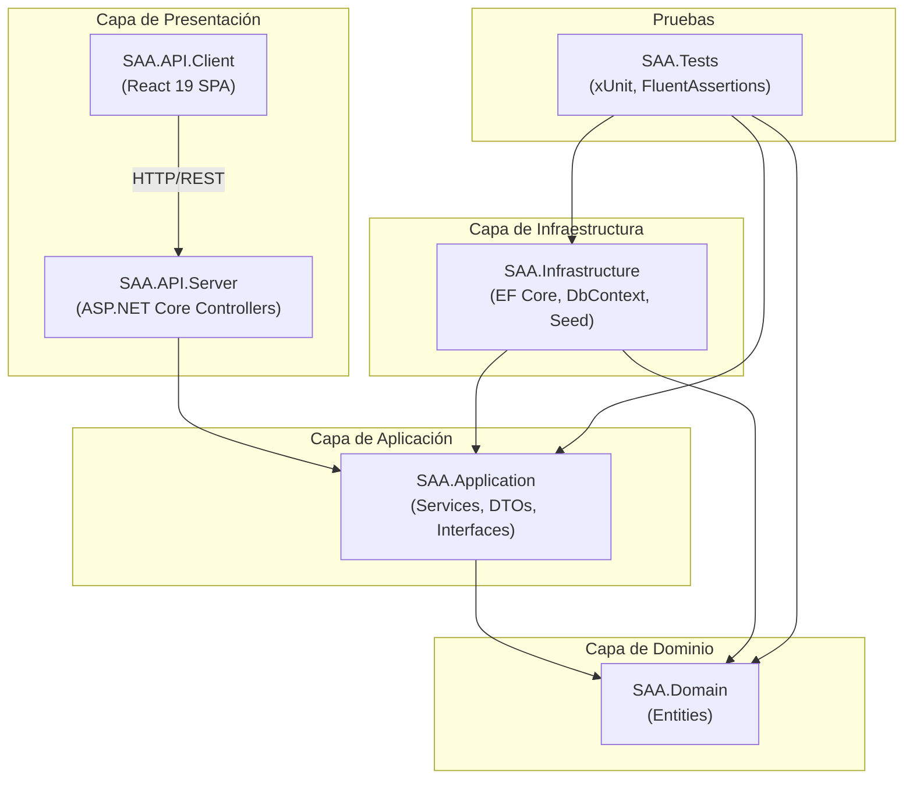
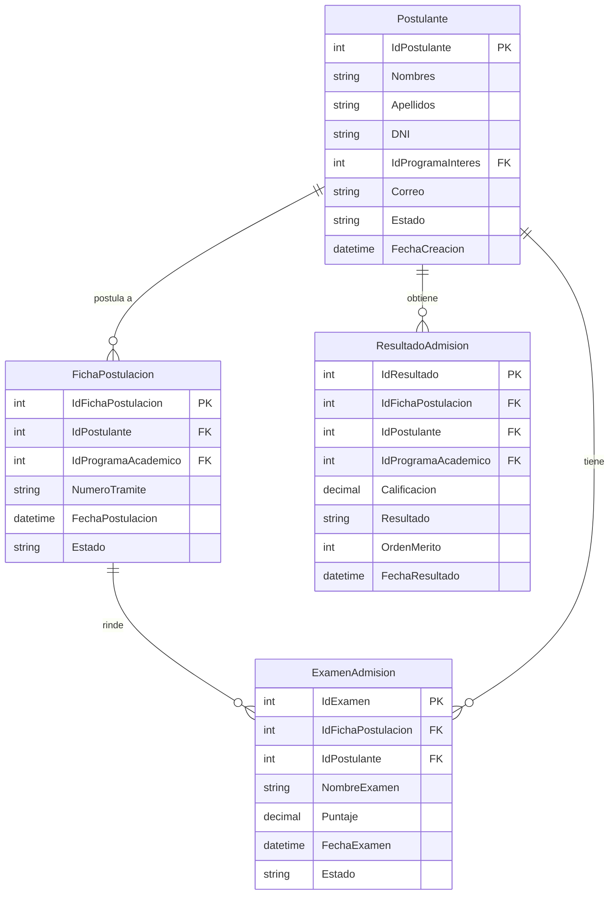
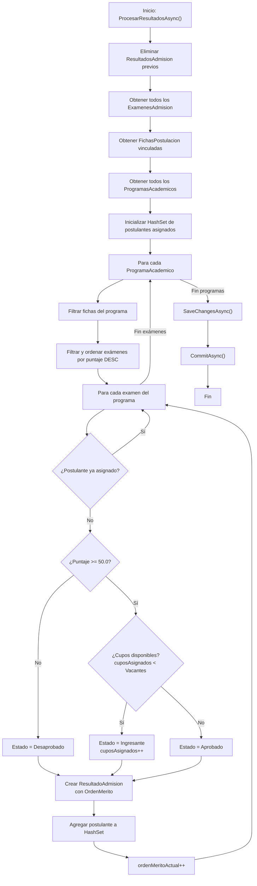
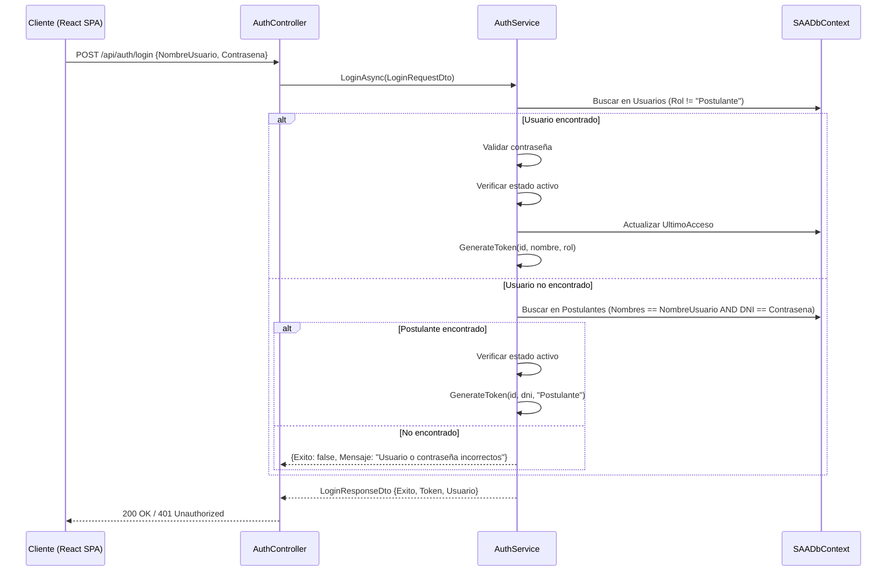

# Diseño Arquitectónico SSD — Sistema Automatizado de Admisión (SAA)

> **Identificador del Cambio:** `001-sistema-admision`  
> **Fecha de Elaboración:** 2026-07-08  
> **Versión del Documento:** 1.0  
> **Documento Asociado:** `proposal.md` (Propuesta SSD)  
> **Estado:** COMPLETADO

---

## 1. Arquitectura General

El Sistema Automatizado de Admisión (SAA) implementa el patrón arquitectónico **Clean Architecture** propuesto por Robert C. Martin, organizado en cuatro capas concéntricas con dependencias dirigidas hacia el centro. Esta arquitectura garantiza la separación de responsabilidades, la testabilidad independiente de cada capa y la independencia respecto a frameworks y proveedores de infraestructura.



### 1.1 Principio de Inversión de Dependencias

La comunicación entre la capa de Aplicación y la capa de Infraestructura se realiza mediante la interfaz `IApplicationDbContext`, definida en `SAA.Application.Interfaces`. Esto permite que los servicios de aplicación operen sin conocimiento del proveedor de persistencia concreto, facilitando la sustitución de SQL Server por InMemory Database durante las pruebas.

### 1.2 Estructura de Proyectos

| Proyecto | Tipo | Ruta Relativa | Responsabilidad |
|---|---|---|---|
| `SAA.Domain` | Class Library | `SAA.Domain/` | Entidades del dominio, reglas de negocio puras |
| `SAA.Application` | Class Library | `SAA.Application/` | Servicios de aplicación, DTOs, interfaces de abstracción |
| `SAA.Infrastructure` | Class Library | `SAA.Infrastructure/` | Implementación de persistencia, EF Core, datos semilla |
| `SAA.API.Server` | Web API | `SAA.API/SAA.API.Server/` | Controladores REST, configuración de middleware, JWT |
| `SAA.API.Client` | React SPA | `SAA.API/saa.api.client/` | Interfaz de usuario, componentes React 19, Vite 7 |
| `SAA.Tests` | xUnit Project | `SAA.Tests/` | Pruebas unitarias e integración |

---

## 2. Capa de Dominio (`SAA.Domain`)

La capa de Dominio contiene las entidades que representan los conceptos del negocio de admisión. Todas las entidades se ubican en el namespace `SAA.Domain.Entities` y carecen de dependencias externas.

### 2.1 Entidades Principales

#### 2.1.1 `Postulante`
Representa a la persona que postula a un programa académico.

| Propiedad | Tipo | Descripción |
|---|---|---|
| `IdPostulante` | `int` | Identificador único (PK) |
| `Nombres` | `string` | Nombres del postulante |
| `Apellidos` | `string` | Apellidos del postulante |
| `DNI` | `string` | Documento Nacional de Identidad (único) |
| `IdProgramaInteres` | `int` | FK al programa académico de interés |
| `Correo` | `string` | Correo electrónico |
| `Telefono` | `string?` | Teléfono de contacto (opcional) |
| `Direccion` | `string?` | Dirección domiciliaria (opcional) |
| `FechaNacimiento` | `DateTime?` | Fecha de nacimiento (opcional) |
| `Estado` | `string` | Estado del registro (`"Activo"`, `"Inactivo"`) |
| `FechaCreacion` | `DateTime` | Timestamp de creación |
| `FechaActualizacion` | `DateTime?` | Timestamp de última modificación |

#### 2.1.2 `ExamenAdmision`
Representa el examen rendido por un postulante con su puntaje resultante.

| Propiedad | Tipo | Descripción |
|---|---|---|
| `IdExamen` | `int` | Identificador único (PK) |
| `IdFichaPostulacion` | `int` | FK a la ficha de postulación |
| `IdPostulante` | `int` | FK al postulante |
| `NombreExamen` | `string` | Tipo de examen (Matemática, Verbal, etc.) |
| `FechaExamen` | `DateTime` | Fecha de realización |
| `HoraInicio` | `TimeSpan?` | Hora de inicio (opcional) |
| `DuracionMinutos` | `int?` | Duración en minutos (opcional) |
| `Sala` | `string?` | Sala o lugar de rendición |
| `Estado` | `string` | Estado (`"Programado"`, `"Realizado"`, `"Pendiente"`, `"Anulado"`) |
| `Puntaje` | `decimal?` | Puntaje obtenido (0 a 1000, precisión 18,2) |
| `Observaciones` | `string?` | Observaciones adicionales |
| `FechaCreacion` | `DateTime` | Timestamp de creación |
| `FechaActualizacion` | `DateTime?` | Timestamp de última modificación |

#### 2.1.3 `ResultadoAdmision`
Representa el resultado final del proceso de admisión para un postulante.

| Propiedad | Tipo | Descripción |
|---|---|---|
| `IdResultado` | `int` | Identificador único (PK) |
| `IdFichaPostulacion` | `int` | FK a la ficha de postulación |
| `IdPostulante` | `int` | FK al postulante |
| `IdProgramaAcademico` | `int` | FK al programa académico |
| `Calificacion` | `decimal?` | Puntaje final (precisión 18,2) |
| `Resultado` | `string` | Decisión: `"Ingresante"`, `"Aprobado"`, `"Desaprobado"` |
| `OrdenMerito` | `int?` | Posición en el cuadro de mérito |
| `Observaciones` | `string?` | Observaciones del evaluador |
| `FechaResultado` | `DateTime` | Fecha de generación del resultado |
| `IdUsuarioEvaluador` | `int?` | FK al usuario que procesó el resultado |
| `FechaActualizacion` | `DateTime?` | Timestamp de última modificación |

#### 2.1.4 `FichaPostulacion`
Vincula a un postulante con un programa académico específico para un proceso de admisión.

| Propiedad | Tipo | Descripción |
|---|---|---|
| `IdFichaPostulacion` | `int` | Identificador único (PK) |
| `IdPostulante` | `int` | FK al postulante |
| `IdProgramaAcademico` | `int` | FK al programa académico |
| `NumeroTramite` | `string` | Número de trámite de la ficha |
| `FechaPostulacion` | `DateTime` | Fecha de registro de la postulación |
| `Estado` | `string` | Estado (`"Registrada"`, `"En Revisión"`, `"Aceptada"`, `"Rechazada"`) |
| `Observaciones` | `string?` | Observaciones sobre la postulación |
| `FechaActualizacion` | `DateTime?` | Timestamp de última modificación |
| `IdUsuarioActualizacion` | `int?` | FK al usuario que realizó la última actualización |

#### 2.1.5 `ProgramaAcademico`
Representa un programa académico ofertado por la institución.

| Propiedad | Tipo | Descripción |
|---|---|---|
| `IdProgramaAcademico` | `int` | Identificador único (PK) |
| `Codigo` | `string` | Código institucional del programa |
| `Nombre` | `string` | Nombre del programa |
| `Descripcion` | `string?` | Descripción del programa |
| `NivelAcademico` | `string?` | Nivel: `"Pregrado"`, `"Postgrado"`, `"Técnico"` |
| `Vacantes` | `int?` | Número de vacantes disponibles |
| `FechaInicioProceso` | `DateTime?` | Inicio del período de admisión |
| `FechaFinalProceso` | `DateTime?` | Cierre del período de admisión |
| `Estado` | `string` | Estado (`"Activo"`, `"Inactivo"`, `"Cerrado"`) |
| `Departamento` | `string?` | Facultad o departamento responsable |
| `FechaCreacion` | `DateTime` | Timestamp de creación |
| `FechaActualizacion` | `DateTime?` | Timestamp de última modificación |

#### 2.1.6 `PeriodoAdmision`
Define un período temporal para el proceso de admisión.

| Propiedad | Tipo | Descripción |
|---|---|---|
| `IdPeriodo` | `int` | Identificador único (PK) |
| `Nombre` | `string` | Nombre del período (ej. "2026-I") |
| `FechaInicio` | `DateTime` | Fecha de inicio del período |
| `FechaFin` | `DateTime` | Fecha de finalización del período |

#### 2.1.7 `Usuario`
Representa un usuario del sistema con credenciales de acceso.

| Propiedad | Tipo | Descripción |
|---|---|---|
| `IdUsuario` | `int` | Identificador único (PK) |
| `NombreUsuario` | `string` | Nombre de usuario para login |
| `Contrasena` | `string` | Contraseña (hash en producción) |
| `NombreCompleto` | `string` | Nombre completo del usuario |
| `Correo` | `string` | Correo electrónico |
| `Rol` | `string` | Rol: `"Administrador"`, `"Evaluador"`, `"Registrador"`, `"Postulante"` |
| `Estado` | `string` | Estado (`"Activo"`, `"Inactivo"`) |
| `UltimoAcceso` | `DateTime?` | Fecha del último inicio de sesión |
| `FechaCreacion` | `DateTime` | Timestamp de creación |
| `FechaActualizacion` | `DateTime?` | Timestamp de última modificación |

#### 2.1.8 `Rol`
Catálogo de roles del sistema.

| Propiedad | Tipo | Descripción |
|---|---|---|
| `IdRol` | `int` | Identificador único (PK) |
| `Nombre` | `string` | Nombre del rol |
| `Descripcion` | `string` | Descripción del rol |

### 2.2 Entidades Complementarias

El modelo de dominio incluye además las siguientes entidades de soporte, definidas en `SAA.Domain.Entities` pero no plenamente integradas en los flujos operativos de la versión actual:

- **`ConfiguracionSistema`**: Parámetros de configuración del sistema.
- **`DocumentoPostulante`**: Referencia a documentos adjuntos del postulante.
- **`LogAuditoria`**: Registro de auditoría de acciones del sistema.
- **`LogMotorAdmision`**: Registro de ejecuciones del motor de admisión.
- **`Matricula`**: Representación de la matrícula post-admisión.
- **`Notificacion`**: Notificaciones para usuarios y postulantes.
- **`Sesion`**: Registro de sesiones de usuario.
- **`TipoDocumento`**: Catálogo de tipos de documentos.

---

## 3. Capa de Aplicación (`SAA.Application`)

La capa de Aplicación orquesta los casos de uso del sistema, coordinando las operaciones entre la capa de Dominio y la capa de Infraestructura a través de la interfaz `IApplicationDbContext`.

### 3.1 Servicios

#### 3.1.1 `MotorAdmisionService`
**Ubicación:** `SAA.Application/Services/MotorAdmisionService.cs`  
**Responsabilidad:** Núcleo del proceso de admisión. Gestiona el registro de exámenes, el procesamiento automático de resultados y la generación de reportes.

| Método | Tipo Retorno | Descripción |
|---|---|---|
| `RegistrarExamenAsync(RegistrarExamenDto)` | `Task` | Registra un examen con puntaje para un postulante existente. Valida existencia del postulante. Opera dentro de transacción. |
| `ProcesarResultadosAsync()` | `Task` | Ejecuta el motor de admisión: elimina resultados previos, agrupa exámenes por programa, ordena por puntaje, aplica umbral (50.0), asigna vacantes y genera `ResultadoAdmision`. |
| `ObtenerReporteIngresantesAsync()` | `Task<List<ReporteIngresanteDto>>` | Genera reporte filtrado por estado `"Ingresante"`, ordenado por puesto de mérito ascendente. |
| `ObtenerReporteTodosAsync()` | `Task<List<ReporteIngresanteDto>>` | Genera reporte general de todos los resultados, ordenado por puntaje descendente. |

#### 3.1.2 `PostulanteService`
**Ubicación:** `SAA.Application/Services/PostulanteService.cs`  
**Responsabilidad:** Gestión del ciclo de vida de los postulantes y consulta de resultados individuales.

| Método | Tipo Retorno | Descripción |
|---|---|---|
| `CrearPostulanteAsync(CrearPostulanteDto)` | `Task<PostulanteResponseDto>` | Crea un postulante con validación de unicidad de DNI. Crea simultáneamente un `Usuario` con rol `"Postulante"`. Opera en transacción atómica. |
| `ObtenerTodosAsync()` | `Task<List<PostulanteResponseDto>>` | Lista todos los postulantes con proyección a DTO. |
| `ObtenerMiResultadoAsync(string dni)` | `Task<MiResultadoDto?>` | Consulta el resultado de admisión de un postulante por su DNI. Retorna puntaje, estado, programa y puesto. |

#### 3.1.3 `AuthService`
**Ubicación:** `SAA.Application/Services/AuthService.cs`  
**Responsabilidad:** Autenticación de usuarios y generación de tokens JWT.

| Método | Tipo Retorno | Descripción |
|---|---|---|
| `LoginAsync(LoginRequestDto)` | `Task<LoginResponseDto>` | Autentica al usuario. Busca primero en la tabla `Usuarios` (no postulantes); si no encuentra, busca en `Postulantes` (login por nombre + DNI como contraseña). Genera token JWT con claims de identidad y rol. |

### 3.2 DTOs (Data Transfer Objects)

| DTO | Archivo | Propósito |
|---|---|---|
| `RegistrarExamenDto` | `AdmisionDTOs.cs` | Datos de entrada para registrar un examen (IdPostulante, Puntaje, Observaciones) |
| `LoginRequestDto` | `AuthDTOs.cs` | Credenciales de autenticación (NombreUsuario, Contrasena) |
| `LoginResponseDto` | `AuthDTOs.cs` | Respuesta de autenticación (Exito, Mensaje, Token, Usuario) |
| `UsuarioDto` | `AuthDTOs.cs` | Datos del usuario autenticado |
| `CrearPostulanteDto` | `PostulanteDTOs.cs` | Datos para registrar un nuevo postulante |
| `PostulanteResponseDto` | `PostulanteDTOs.cs` | Datos de respuesta del postulante creado/consultado |
| `ReporteIngresanteDto` | `ReporteIngresanteDto.cs` | Datos para reportes (DNI, Nombres, Apellidos, Programa, Puntaje, Puesto, Fecha, Estado) |
| `MiResultadoDto` | `MiResultadoDto.cs` | Resultado individual del postulante (Nombres, Apellidos, Programa, Puntaje, Estado, Puesto) |

### 3.3 Interfaces

| Interfaz | Descripción |
|---|---|
| `IApplicationDbContext` | Abstracción del contexto de base de datos. Expone `DbSet<T>` para todas las entidades y las operaciones `SaveChangesAsync()` y `Database`. |

---

## 4. Capa de Infraestructura (`SAA.Infrastructure`)

### 4.1 `SAADbContext`
**Ubicación:** `SAA.Infrastructure/Data/SAADbContext.cs`  
**Herencia:** `DbContext`, implementa `IApplicationDbContext`

El contexto de base de datos configura el mapeo de entidades a tablas mediante Fluent API en `OnModelCreating()`:

```csharp
// Esquema Seguridad
modelBuilder.Entity<Usuario>().ToTable("Usuario", "Seguridad").HasKey(u => u.IdUsuario);
modelBuilder.Entity<Rol>().ToTable("Rol", "Seguridad").HasKey(r => r.IdRol);

// Esquema Admision
modelBuilder.Entity<Postulante>().ToTable("Postulante", "Admision").HasKey(p => p.IdPostulante);
modelBuilder.Entity<FichaPostulacion>().ToTable("FichaPostulacion", "Admision").HasKey(f => f.IdFichaPostulacion);
modelBuilder.Entity<ExamenAdmision>().ToTable("ExamenAdmision", "Admision").HasKey(e => e.IdExamen);
modelBuilder.Entity<ResultadoAdmision>().ToTable("ResultadoAdmision", "Admision").HasKey(r => r.IdResultado);

// Esquema Config
modelBuilder.Entity<ProgramaAcademico>().ToTable("ProgramaAcademico", "Config").HasKey(p => p.IdProgramaAcademico);
modelBuilder.Entity<PeriodoAdmision>().ToTable("PeriodoAdmision", "Config").HasKey(p => p.IdPeriodo);
```

### 4.2 Configuración de Precisión

Las propiedades monetarias/decimales están configuradas con precisión `(18, 2)`:
- `ExamenAdmision.Puntaje` → `HasPrecision(18, 2)`
- `ResultadoAdmision.Calificacion` → `HasPrecision(18, 2)`

### 4.3 `SeedDataService`
Servicio de datos semilla que precarga la base de datos con información de demostración: programas académicos, postulantes, fichas de postulación, exámenes, usuarios administradores y roles. Se ejecuta al iniciar la aplicación para facilitar el desarrollo y las pruebas.

---

## 5. Capa de Presentación

### 5.1 API Controllers (Backend)

#### 5.1.1 `AuthController`
**Ruta base:** `api/auth`

| Método HTTP | Endpoint | Autorización | Descripción |
|---|---|---|---|
| `POST` | `api/auth/login` | Anónimo | Autentica usuario y retorna JWT |

#### 5.1.2 `PostulantesController`
**Ruta base:** `api/postulantes`

| Método HTTP | Endpoint | Autorización | Descripción |
|---|---|---|---|
| `POST` | `api/postulantes` | Anónimo | Registra nuevo postulante |
| `GET` | `api/postulantes` | Anónimo | Lista todos los postulantes |
| `GET` | `api/postulantes/mi-resultado` | `Postulante` | Consulta resultado individual por DNI del token |

#### 5.1.3 `AdmisionController`
**Ruta base:** `api/admision`

| Método HTTP | Endpoint | Autorización | Descripción |
|---|---|---|---|
| `POST` | `api/admision/examen` | `Administrador` | Registra examen con puntaje |
| `POST` | `api/admision/procesar` | `Administrador` | Ejecuta el motor de admisión |
| `GET` | `api/admision/reporte-ingresantes` | `Administrador` | Obtiene reporte de ingresantes |
| `GET` | `api/admision/reporte-todos` | `Administrador` | Obtiene reporte general |

### 5.2 Frontend (React 19 SPA)
**Ubicación:** `SAA.API/saa.api.client/`  
**Stack:** React 19, TypeScript, Vite 7, CSS

La SPA provee interfaces diferenciadas por rol:
- **Login:** Formulario de autenticación con redirección basada en rol.
- **Dashboard Administrador:** Gestión de postulantes, registro de exámenes, ejecución del motor, visualización de reportes.
- **Dashboard Postulante:** Consulta de resultado individual, datos del programa y posición de mérito.

---

## 6. Modelo de Datos

El modelo de datos se organiza en tres esquemas de base de datos que reflejan las áreas funcionales del sistema:

### 6.1 Esquema `Admision`



### 6.2 Esquema `Config`

| Tabla | Clave Primaria | Propósito |
|---|---|---|
| `ProgramaAcademico` | `IdProgramaAcademico` | Catálogo de programas con vacantes y estado |
| `PeriodoAdmision` | `IdPeriodo` | Definición de períodos de admisión |

### 6.3 Esquema `Seguridad`

| Tabla | Clave Primaria | Propósito |
|---|---|---|
| `Usuario` | `IdUsuario` | Credenciales y datos de usuarios del sistema |
| `Rol` | `IdRol` | Catálogo de roles (Administrador, Postulante, etc.) |

---

## 7. Flujo del Motor de Admisión

El motor de admisión, implementado en `MotorAdmisionService.ProcesarResultadosAsync()`, ejecuta el siguiente flujo algorítmico:



### 7.1 Reglas de Negocio del Motor

| # | Regla | Implementación |
|---|---|---|
| 1 | Los resultados anteriores se eliminan completamente antes de cada procesamiento. | `_context.ResultadosAdmision.RemoveRange(previousResultados)` |
| 2 | Los exámenes se agrupan por programa académico a través de la ficha de postulación. | Join entre `ExamenesAdmision` y `FichasPostulacion` por `IdFichaPostulacion` |
| 3 | Dentro de cada programa, los postulantes se ordenan por puntaje en orden descendente. | `.OrderByDescending(e => e.Puntaje)` |
| 4 | Un postulante solo puede ser asignado a un programa (primera asignación gana). | `HashSet<int> postulantesAsignados` con verificación `Contains()` |
| 5 | El umbral aprobatorio es **50.0 puntos** (`decimal`). | `examen.Puntaje >= 50.0m` |
| 6 | Los postulantes aprobados con vacantes disponibles reciben estado `"Ingresante"`. | `cuposAsignados < (prog.Vacantes ?? 0)` |
| 7 | Los postulantes aprobados sin vacantes reciben estado `"Aprobado"`. | Rama else del condicional de vacantes |
| 8 | Los postulantes bajo el umbral reciben estado `"Desaprobado"`. | Estado por defecto `"Desaprobado"` |
| 9 | El orden de mérito es secuencial por programa, independiente del estado final. | `ordenMeritoActual++` para cada postulante evaluado |

---

## 8. Autenticación y Autorización

### 8.1 Flujo de Autenticación JWT



### 8.2 Estructura del Token JWT

| Claim | Valor | Descripción |
|---|---|---|
| `NameIdentifier` | `IdUsuario` o `IdPostulante` | Identificador numérico del usuario |
| `Name` | `NombreUsuario` o `DNI` | Identificador textual |
| `Role` | `"Administrador"` o `"Postulante"` | Rol para autorización |

**Configuración del token:**
- **Algoritmo:** HMAC-SHA256
- **Expiración:** 2 horas (`DateTime.UtcNow.AddHours(2)`)
- **Issuer/Audience:** Configurables vía `appsettings.json` (`Jwt:Issuer`, `Jwt:Audience`)

### 8.3 Matriz de Autorización

| Endpoint | Anónimo | Postulante | Administrador |
|---|---|---|---|
| `POST api/auth/login` | ✅ | ✅ | ✅ |
| `POST api/postulantes` | ✅ | ✅ | ✅ |
| `GET api/postulantes` | ✅ | ✅ | ✅ |
| `GET api/postulantes/mi-resultado` | ❌ | ✅ | ❌ |
| `POST api/admision/examen` | ❌ | ❌ | ✅ |
| `POST api/admision/procesar` | ❌ | ❌ | ✅ |
| `GET api/admision/reporte-ingresantes` | ❌ | ❌ | ✅ |
| `GET api/admision/reporte-todos` | ❌ | ❌ | ✅ |

---

## 9. Decisiones de Diseño

### 9.1 Tabla de Decisiones Arquitectónicas

| # | Decisión | Alternativas Consideradas | Justificación |
|---|---|---|---|
| **DD-01** | **Clean Architecture** con 4 capas | Arquitectura N-capas tradicional, MVC monolítico | Facilita la testabilidad independiente de cada capa, respeta el principio de inversión de dependencias y permite sustituir la infraestructura sin afectar la lógica de negocio. |
| **DD-02** | **.NET 10** con ASP.NET Core Web API | Node.js/Express, Java/Spring Boot | .NET 10 ofrece rendimiento superior, tipado fuerte con C#, integración nativa con Entity Framework Core y soporte de largo plazo (LTS). |
| **DD-03** | **React 19** con TypeScript y Vite 7 | Angular, Vue.js, Blazor | React 19 provee un ecosistema maduro, componentes funcionales con hooks, y Vite 7 garantiza tiempos de compilación mínimos durante el desarrollo. |
| **DD-04** | **Entity Framework Core 10** como ORM | Dapper, ADO.NET directo, NHibernate | EF Core 10 proporciona Fluent API para mapeo, migraciones automáticas, LINQ integrado y soporte nativo para InMemory Database en pruebas. |
| **DD-05** | **InMemory Database** para pruebas | SQLite en modo memoria, contenedor Docker con SQL Server | InMemory Database elimina la dependencia de infraestructura externa durante las pruebas, permitiendo ejecución rápida y paralela. La gestión de transacciones se adapta con `try/catch` para `InvalidOperationException`. |
| **DD-06** | **JWT** para autenticación | Cookies de sesión, OAuth2 con proveedor externo | JWT permite autenticación stateless compatible con arquitecturas SPA y APIs RESTful. La expiración de 2 horas balancea seguridad y experiencia de usuario. |
| **DD-07** | **Flujo dual de autenticación** (Usuario vs. Postulante) | Tabla unificada de credenciales | Permite que los postulantes se autentiquen con su nombre y DNI sin necesidad de gestionar credenciales adicionales, simplificando la experiencia de usuario. |
| **DD-08** | **Esquemas de base de datos** (`Admision`, `Config`, `Seguridad`) | Esquema único `dbo` | La separación por esquemas organiza las tablas por dominio funcional, facilita la gestión de permisos a nivel de esquema y mejora la legibilidad del modelo de datos. |
| **DD-09** | **Reprocesamiento completo** del motor de admisión | Procesamiento incremental | El reprocesamiento completo (eliminar y recalcular) garantiza consistencia total de los resultados ante cualquier modificación de datos, a costa de mayor costo computacional en cada ejecución. |
| **DD-10** | **Scrum adaptado** a un solo desarrollador | Kanban, Waterfall | Scrum provee estructura iterativa e incremental con sprints definidos, compatible con la metodología SSD para organizar la documentación de especificaciones por iteraciones. |

---

> **Aprobación:** Este documento ha sido revisado y aprobado conforme a los lineamientos del marco SSD-OpenSpec.  
> **Autor:** Equipo de Desarrollo SAA  
> **Fecha de Aprobación:** 2026-07-08
