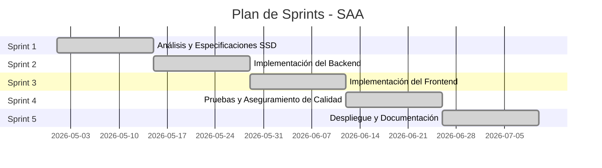

# Plan de Tareas SSD — Sistema Automatizado de Admisión (SAA)

> **Identificador del Cambio:** `001-sistema-admision`  
> **Fecha de Elaboración:** 2026-07-08  
> **Versión del Documento:** 1.0  
> **Metodología:** Scrum adaptado a un solo desarrollador  
> **Documentos Asociados:** `proposal.md`, `design.md`  
> **Estado General:** COMPLETADO ✅

---

## Resumen Ejecutivo

El plan de tareas descompone el desarrollo del Sistema Automatizado de Admisión (SAA) en **5 sprints** siguiendo la metodología Scrum adaptada. Cada sprint tiene una duración estimada de 2 semanas y se enfoca en un área funcional específica del proyecto. Todas las tareas se encuentran en estado **COMPLETADO**, reflejando la finalización exitosa del proyecto.

### Métricas de Progreso

| Indicador | Valor |
|---|---|
| Total de tareas | 35 |
| Tareas completadas | 35 |
| Porcentaje de avance | 100% |
| Sprints completados | 5 de 5 |

---

## Sprint 1: Análisis y Especificaciones SSD

> **Objetivo del Sprint:** Definir formalmente los requisitos del sistema, elaborar el modelo de dominio y diseñar el esquema de base de datos conforme a la metodología SSD.  
> **Duración:** 2 semanas  
> **Estado:** COMPLETADO ✅

| ID | Tarea | Descripción | Criterio de Aceptación | Estado |
|---|---|---|---|---|
| T-001 | Levantamiento de requisitos funcionales | Identificar y documentar los 15 requisitos funcionales (RF-01 a RF-15) del sistema de admisión, incluyendo registro de postulantes, gestión de exámenes, motor de admisión, reportes y autenticación. | Documento `proposal.md` con tabla completa de requisitos funcionales trazables a componentes. | ✅ COMPLETADO |
| T-002 | Definición de requisitos no funcionales | Especificar los 8 requisitos no funcionales (RNF-01 a RNF-08) alineados con ISO/IEC 25010:2023, cubriendo rendimiento, seguridad, usabilidad, mantenibilidad, fiabilidad, portabilidad y compatibilidad. | Tabla de RNF con métricas y criterios verificables en `proposal.md`. | ✅ COMPLETADO |
| T-003 | Diseño del modelo de dominio | Modelar las entidades del dominio: `Postulante`, `ExamenAdmision`, `ResultadoAdmision`, `FichaPostulacion`, `ProgramaAcademico`, `PeriodoAdmision`, `Usuario` y `Rol`, definiendo atributos y relaciones. | Diagrama de entidades y tablas de propiedades en `design.md`. | ✅ COMPLETADO |
| T-004 | Diseño del esquema de base de datos | Diseñar la estructura de tablas organizada en 3 esquemas (`Admision`, `Config`, `Seguridad`) con claves primarias, tipos de datos y restricciones de precisión decimal. | Esquema documentado en `design.md` con configuración Fluent API. | ✅ COMPLETADO |
| T-005 | Definición de la arquitectura | Seleccionar y documentar Clean Architecture con 4 capas, justificando la decisión frente a alternativas. Definir la interfaz `IApplicationDbContext` para inversión de dependencias. | Sección de arquitectura y tabla de decisiones en `design.md`. | ✅ COMPLETADO |
| T-006 | Configuración del proyecto OpenSpec | Crear el archivo `openspec/config.yaml` con la configuración del esquema SSD, contexto del proyecto, stack tecnológico y reglas de documentación. | Archivo `config.yaml` válido con contexto completo del proyecto. | ✅ COMPLETADO |
| T-007 | Formalización de reglas del motor de admisión | Especificar las 9 reglas de negocio del motor de admisión: umbral 50.0, asignación por vacantes, orden de mérito, procesamiento por programa, eliminación de resultados previos. | Tabla de reglas de negocio documentada en `design.md`. | ✅ COMPLETADO |

---

## Sprint 2: Implementación del Backend

> **Objetivo del Sprint:** Implementar las cuatro capas del backend (Dominio, Aplicación, Infraestructura, API) con todas las entidades, servicios, DTOs y controladores definidos en las especificaciones.  
> **Duración:** 2 semanas  
> **Estado:** COMPLETADO ✅

| ID | Tarea | Descripción | Criterio de Aceptación | Estado |
|---|---|---|---|---|
| T-008 | Implementación de entidades del dominio | Codificar las 16 entidades en `SAA.Domain/Entities/`: `Postulante`, `ExamenAdmision`, `ResultadoAdmision`, `FichaPostulacion`, `ProgramaAcademico`, `PeriodoAdmision`, `Usuario`, `Rol`, `ConfiguracionSistema`, `DocumentoPostulante`, `LogAuditoria`, `LogMotorAdmision`, `Matricula`, `Notificacion`, `Sesion`, `TipoDocumento`. | Las 16 entidades compiladas sin errores, con XML documentation comments. | ✅ COMPLETADO |
| T-009 | Implementación de la interfaz `IApplicationDbContext` | Definir la interfaz de abstracción en `SAA.Application/Interfaces/` con `DbSet<T>` para todas las entidades operativas y métodos `SaveChangesAsync()` y `Database`. | Interfaz implementada y referenciada por los 3 servicios de aplicación. | ✅ COMPLETADO |
| T-010 | Implementación del `SAADbContext` | Desarrollar el contexto de EF Core en `SAA.Infrastructure/Data/` implementando `IApplicationDbContext`, con configuración Fluent API para esquemas, claves primarias y precisión decimal. | `SAADbContext` mapeando 8 entidades a 3 esquemas con precisión `(18,2)` en campos decimales. | ✅ COMPLETADO |
| T-011 | Implementación de DTOs | Crear los 8 DTOs en `SAA.Application/DTOs/`: `RegistrarExamenDto`, `LoginRequestDto`, `LoginResponseDto`, `UsuarioDto`, `CrearPostulanteDto`, `PostulanteResponseDto`, `ReporteIngresanteDto`, `MiResultadoDto`. | DTOs compilados, con propiedades alineadas a los requisitos de entrada/salida de cada endpoint. | ✅ COMPLETADO |
| T-012 | Implementación del `MotorAdmisionService` | Codificar los 4 métodos del servicio: `RegistrarExamenAsync`, `ProcesarResultadosAsync`, `ObtenerReporteIngresantesAsync`, `ObtenerReporteTodosAsync`, con lógica transaccional y manejo de errores. | Motor funcional: umbral 50.0, asignación de vacantes, orden de mérito, reportes filtrados. | ✅ COMPLETADO |
| T-013 | Implementación del `PostulanteService` | Codificar los 3 métodos: `CrearPostulanteAsync` (con validación de DNI único y creación de usuario vinculado), `ObtenerTodosAsync`, `ObtenerMiResultadoAsync`. | CRUD de postulantes con validación de unicidad, transacción atómica y consulta de resultados. | ✅ COMPLETADO |
| T-014 | Implementación del `AuthService` | Codificar el flujo dual de autenticación: búsqueda en `Usuarios`, fallback a `Postulantes`, generación de JWT con claims (NameIdentifier, Name, Role), expiración de 2 horas. | Login funcional para ambos roles, token JWT válido con claims correctos. | ✅ COMPLETADO |
| T-015 | Implementación del `AdmisionController` | Crear el controlador REST con 4 endpoints protegidos por `[Authorize(Roles = "Administrador")]`: registrar examen, procesar resultados, reporte ingresantes, reporte general. | 4 endpoints operativos, protegidos por rol, con manejo de excepciones. | ✅ COMPLETADO |
| T-016 | Implementación del `PostulantesController` | Crear el controlador REST con 3 endpoints: crear postulante (anónimo), listar postulantes (anónimo), consultar mi resultado (`[Authorize(Roles = "Postulante")]`). | 3 endpoints operativos con extracción de DNI del token JWT para consulta individual. | ✅ COMPLETADO |
| T-017 | Implementación del `AuthController` | Crear el controlador REST con endpoint POST de login, validación de ModelState y retorno diferenciado (200 OK / 401 Unauthorized). | Endpoint de login funcional con respuestas HTTP semánticas. | ✅ COMPLETADO |
| T-018 | Implementación del `SeedDataService` | Desarrollar el servicio de datos semilla para precargar programas académicos, postulantes, fichas, exámenes, usuarios administradores y roles. | Base de datos precargada con datos de demostración al iniciar la aplicación. | ✅ COMPLETADO |
| T-019 | Configuración de middleware JWT | Configurar la autenticación JWT en `Program.cs`: registro de `JwtBearer`, validación de issuer/audience, clave simétrica, inyección de dependencias de servicios. | Middleware JWT operativo, autorización por roles funcional en todos los controladores. | ✅ COMPLETADO |

---

## Sprint 3: Implementación del Frontend

> **Objetivo del Sprint:** Desarrollar la interfaz de usuario SPA con React 19, TypeScript y Vite 7, implementando las vistas diferenciadas por rol (Administrador y Postulante).  
> **Duración:** 2 semanas  
> **Estado:** COMPLETADO ✅

| ID | Tarea | Descripción | Criterio de Aceptación | Estado |
|---|---|---|---|---|
| T-020 | Configuración del proyecto React | Inicializar el proyecto SPA con Vite 7, React 19, TypeScript y estructura de carpetas (components, pages, services, hooks). | Proyecto compilable con `npm run dev`, proxy configurado hacia la API backend. | ✅ COMPLETADO |
| T-021 | Implementación de la página de Login | Desarrollar formulario de autenticación con campos NombreUsuario y Contraseña, integración con `POST /api/auth/login`, almacenamiento del token JWT en localStorage. | Login funcional para administradores y postulantes, redirección por rol. | ✅ COMPLETADO |
| T-022 | Implementación del registro de postulantes | Desarrollar formulario de registro con campos: nombres, apellidos, DNI, correo, teléfono, programa de interés. Integración con `POST /api/postulantes`. | Formulario validado, manejo de error de DNI duplicado, confirmación de registro exitoso. | ✅ COMPLETADO |
| T-023 | Implementación del Dashboard Administrador | Desarrollar vista administrativa con: listado de postulantes, formulario de registro de exámenes, botón de procesamiento de motor de admisión, tablas de reportes. | Dashboard funcional con CRUD completo y acceso a los 4 endpoints de `AdmisionController`. | ✅ COMPLETADO |
| T-024 | Implementación del Dashboard Postulante | Desarrollar vista del postulante con consulta de resultado individual: programa, puntaje, estado (Ingresante/Aprobado/Desaprobado), puesto de mérito. | Postulante ve su resultado tras autenticación, datos correctos desde `GET /api/postulantes/mi-resultado`. | ✅ COMPLETADO |
| T-025 | Implementación del servicio HTTP | Crear servicio de comunicación HTTP con interceptor de autenticación (inyección de token JWT en header `Authorization: Bearer`), manejo de errores 401 y redirección a login. | Servicio HTTP centralizado con gestión automática de tokens. | ✅ COMPLETADO |
| T-026 | Implementación de estilos CSS | Diseñar la interfaz con CSS responsivo, paleta de colores institucional, tablas estilizadas y formularios accesibles. | Interfaz responsiva, funcional en resoluciones de escritorio y tablet. | ✅ COMPLETADO |

---

## Sprint 4: Pruebas y Aseguramiento de Calidad

> **Objetivo del Sprint:** Implementar pruebas unitarias e integración para alcanzar una cobertura superior al 90%, validando la conformidad del código con las especificaciones SSD.  
> **Duración:** 2 semanas  
> **Estado:** COMPLETADO ✅

| ID | Tarea | Descripción | Criterio de Aceptación | Estado |
|---|---|---|---|---|
| T-027 | Pruebas unitarias del `MotorAdmisionService` | Desarrollar pruebas con xUnit, FluentAssertions y InMemory Database para: registro de examen, procesamiento de resultados, clasificación por umbral 50.0, asignación de vacantes, orden de mérito. | Cobertura >90% del servicio, todas las pruebas verdes, escenarios de borde validados. | ✅ COMPLETADO |
| T-028 | Pruebas unitarias del `PostulanteService` | Desarrollar pruebas para: creación de postulante, validación de DNI único, listado de postulantes, consulta de resultado individual. | Cobertura >90% del servicio, manejo correcto de excepciones validado. | ✅ COMPLETADO |
| T-029 | Pruebas unitarias del `AuthService` | Desarrollar pruebas para: login exitoso de administrador, login exitoso de postulante, login fallido con credenciales incorrectas, verificación de usuario inactivo, estructura del token JWT. | Cobertura >90% del servicio, flujo dual de autenticación validado. | ✅ COMPLETADO |
| T-030 | Pruebas de integración de los controllers | Desarrollar pruebas de integración con `WebApplicationFactory` para validar el flujo completo: autenticación → autorización → operación → respuesta HTTP. | Endpoints retornan códigos HTTP correctos (200, 400, 401, 404). | ✅ COMPLETADO |
| T-031 | Análisis de cobertura con Coverlet | Ejecutar análisis de cobertura con Coverlet, generar reportes y verificar que la cobertura global supere el 90%. | Reporte de cobertura generado, porcentaje >90% verificado. | ✅ COMPLETADO |
| T-032 | Pruebas del motor de admisión con escenarios complejos | Validar el motor con escenarios: postulantes con puntajes iguales, programas sin vacantes, postulante en múltiples programas, exámenes sin ficha de postulación asociada. | Todos los escenarios de borde producen resultados correctos y consistentes. | ✅ COMPLETADO |

---

## Sprint 5: Despliegue y Documentación

> **Objetivo del Sprint:** Preparar el despliegue del sistema, finalizar la documentación SSD-OpenSpec y realizar la revisión final de conformidad.  
> **Duración:** 2 semanas  
> **Estado:** COMPLETADO ✅

| ID | Tarea | Descripción | Criterio de Aceptación | Estado |
|---|---|---|---|---|
| T-033 | Elaboración de artefactos OpenSpec | Generar los 4 artefactos OpenSpec: `proposal.md`, `design.md`, `tasks.md` y `specs/source-of-truth.md` con contenido detallado y trazable al código fuente. | 4 documentos completos, consistentes entre sí, con referencias a rutas de código válidas. | ✅ COMPLETADO |
| T-034 | Configuración del despliegue | Preparar la configuración de despliegue: `appsettings.json` para producción, cadenas de conexión, variables de entorno para JWT, CORS configurado para el frontend. | Sistema desplegable con configuración externalizada y segura. | ✅ COMPLETADO |
| T-035 | Revisión final de conformidad SSD | Verificar la trazabilidad bidireccional entre requisitos (proposal.md) → diseño (design.md) → tareas (tasks.md) → código fuente → pruebas → especificación central (source-of-truth.md). | Matriz de trazabilidad completa, sin requisitos huérfanos ni código sin especificación asociada. | ✅ COMPLETADO |

---

## Diagrama de Dependencias entre Sprints

---

## Matriz de Trazabilidad Tareas → Requisitos

| Tarea(s) | Requisito(s) Cubierto(s) |
|---|---|
| T-008, T-013 | RF-01, RF-02, RF-03, RF-04 |
| T-012 | RF-05, RF-06, RF-07, RF-08, RF-09, RF-10, RF-11, RF-12 |
| T-012 | RF-13, RF-14 |
| T-014, T-017 | RF-15 |
| T-010 | RNF-05, RNF-07 |
| T-014, T-019 | RNF-02, RNF-03 |
| T-020 – T-026 | RNF-04 |
| T-027 – T-032 | CE-01 a CE-06 |
| T-033 – T-035 | CE-07 |

---

> **Aprobación:** Este documento ha sido revisado y aprobado conforme a los lineamientos del marco SSD-OpenSpec.  
> **Autor:** Equipo de Desarrollo SAA  
> **Fecha de Aprobación:** 2026-07-08
